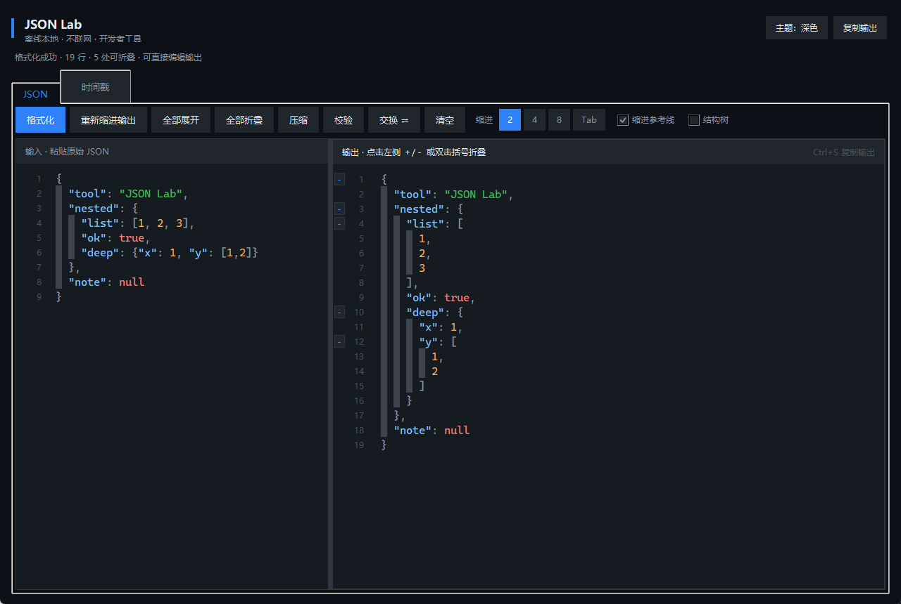
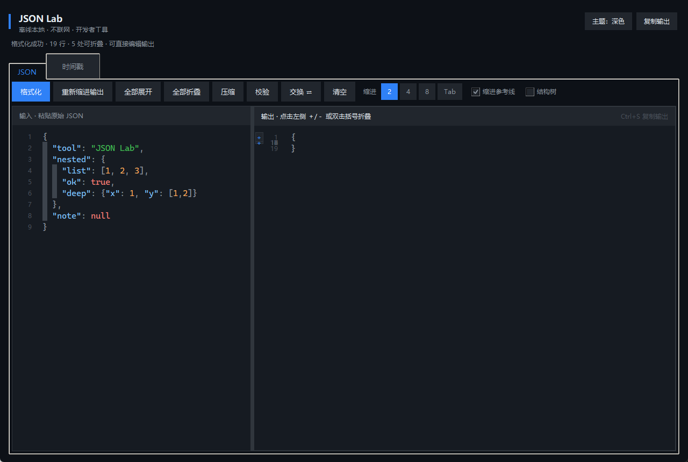

# JSON Lab

> JSON 格式化 & 时间戳转换 — Windows 桌面离线工具  
> JSON formatting & timestamp conversion — offline desktop tool for Windows

[中文](#中文) | [English](#english)



---

## 中文

**JSON Lab** 是一款轻量、完全离线的 Windows 桌面工具，用于 JSON 格式化查看/编辑，以及 Unix 时间戳与日期时间互转。

### 功能

**JSON 工具**
- 格式化（缩进 2 / 4 / 8 / Tab）
- 压缩 minify
- 校验 JSON 是否合法
- 语法高亮（键 / 字符串 / 数字 / 布尔 / null）
- 缩进参考线
- **折叠 / 展开**：点击行号侧栏 `＋` / `－`，或双击 `{` `[` 行
- 全部展开 / 全部折叠
- 结构树（可选）
- 复制输出（`Ctrl+S`）、交换输入输出

**时间戳转换**
- 实时显示当前秒 / 毫秒时间戳
- 时间戳 → 时间：自动识别秒 / 毫秒，也可手动指定
- 时间 → 时间戳：秒 / 毫秒 / 微秒
- 时区：本机 / UTC / 北京时间 +8
- 深色 / 浅色主题

### 运行

**方式一：直接使用 exe**

从 [Releases](../../releases) 下载 `JSONLab.exe`，双击即可运行，无需安装 Python。

**方式二：源码运行**

```powershell
python main.py
```

依赖：Python 3.10+（仅标准库 `tkinter`，无需 pip 安装第三方包）

**打包 exe**

```powershell
pip install pyinstaller
pyinstaller --onefile --noconsole --name "JSONLab" main.py
```

产物位于 `dist\JSONLab.exe`。

### 界面预览

| 展开 | 折叠 |
|------|------|
|  |  |

### 许可

[MIT License](LICENSE)

---

## English

**JSON Lab** is a lightweight, fully offline Windows desktop tool for JSON format/view/edit and Unix timestamp conversion.

### Features

**JSON**
- Format (indent 2 / 4 / 8 / Tab)
- Minify
- Validate
- Syntax highlighting (keys / strings / numbers / booleans / null)
- Indent guides
- **Fold / expand** JSON blocks via `＋` / `－` in the gutter, or double-click a `{` / `[` line
- Expand all / Collapse all
- Optional structure tree
- Copy output (`Ctrl+S`), swap input/output

**Timestamps**
- Live current Unix timestamp (seconds & milliseconds)
- Timestamp → date/time (auto-detect seconds/milliseconds)
- Date/time → timestamp (seconds / milliseconds / microseconds)
- Timezones: local / UTC / UTC+8
- Dark / light theme

### Run

**Option A — prebuilt exe**

Download `JSONLab.exe` from [Releases](../../releases) and double-click. No Python required.

**Option B — from source**

```powershell
python main.py
```

Requires Python 3.10+ (stdlib `tkinter` only, no third-party packages).

**Build exe**

```powershell
pip install pyinstaller
pyinstaller --onefile --noconsole --name "JSONLab" main.py
```

### License

[MIT License](LICENSE)
